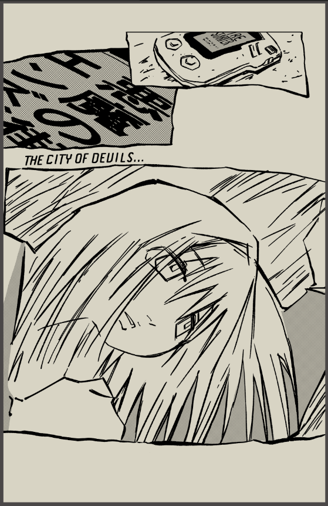

<h1 align="center">

</h1>

  
   
  <i>"This town is too small for amazing things."</i> 
  

 

  

<h2 align="center"> About Me</h2>

<table align="center">
  <tr>
    <td align="center">
      
    </td>
    <td>
      <ul>
        <li>Urban photographer capturing life's quiet moments</li>
        <li>Finding solace in gaming and wandering</li>
        <li>Bridge dweller and contemplative soul</li>
        <li>Friend to stray cats</li>
        <li>Music enthusiast </li>
      </ul>
    </td>
  </tr>
</table>

<h2 align="center"> Current Vibe</h2>

  

<h2 align="center"> Skills & Interests</h2>

  
  
  
  

<h2 align="center">Connect</h2>

  
  

   
  <i>"Nothing amazing happens here. Everything is ordinary."</i> 

